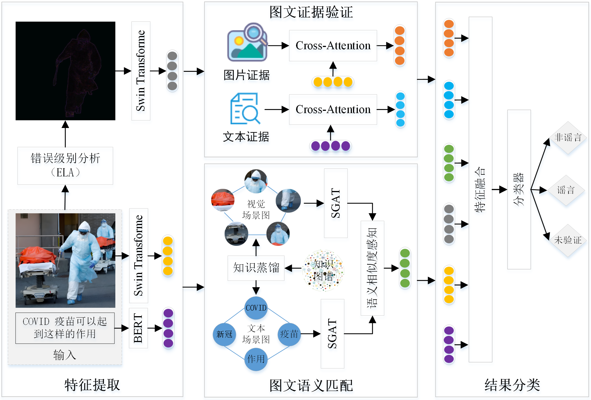

## The framework of the proposed model:

## Datasets
* For the original data, please download it from Google Drive  <a href="https://drive.google.com/file/d/14NNqLKSW1FzLGuGkqwlzyIPXnKDzEFX4/view?usp=sharing" target='_blank'>link</a>  or Baidu Cloud  <a href="https://pan.baidu.com/s/1OV_Oab0zQgI8P2Wo1qwBuw?pwd=1odv" target='_blank'>link</a>.
* We have also uploaded the preprocessed ELA images and scene graphs to Baidu Cloud. The download link is: https://pan.baidu.com/s/1I3WCdVh67Ci1D-OIMjx0tA?pwd=s9fn
  
## Dependencies
* tqdm==4.63.1
* torch==1.12.1+cu113
* seaborn==0.11.2
* matplotlib==3.3.4
* Pillow==8.4.0
* pytorch_lightning==1.9.0
* transformers==4.18.0
* pycocotools
* torchmetrics==1.4.0.post0
* nltk==3.7
* scikit_learn==0.24.2
* wordcloud==1.8.1
* torchvision==0.13.1+cu113
* requests==2.27.1
* tabulate==0.8.9
* packaging==21.3
* pandas==1.1.5
* dgl_cu111==0.6.1
* Cython==0.29.28
* numpy==1.21.0
* FactualSceneGraph
* sentence_transformers
* SPARQLWrapper==2.0.0
* jieba==0.42.1
* spacy==3.8.2

## Run
python main.py --dataset twitter --model SGKE --batch 32

## Acknowledgements
Thank you to **Xuming Hu** (Tsinghua University, Beijing, China), **Zhijiang Guo** (University of Cambridge, Cambridge, United Kingdom), **Junzhe Chen** (Tsinghua University, Beijing, China), **Lijie Wen** (Tsinghua University, Beijing, China), and **Philip S Yu** (University of Illinois at Chicago, Chicago, IL, USA) for providing the dataset.

